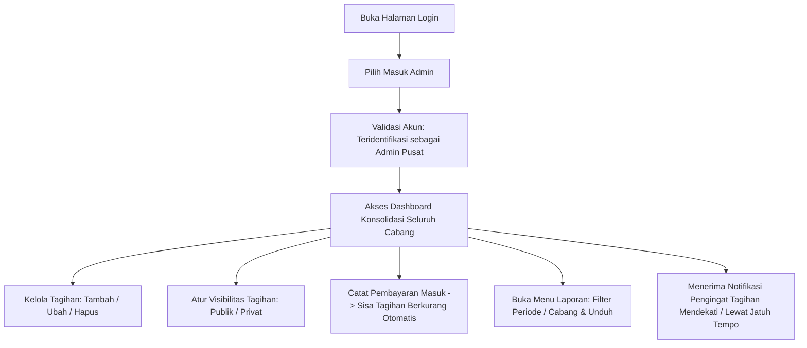
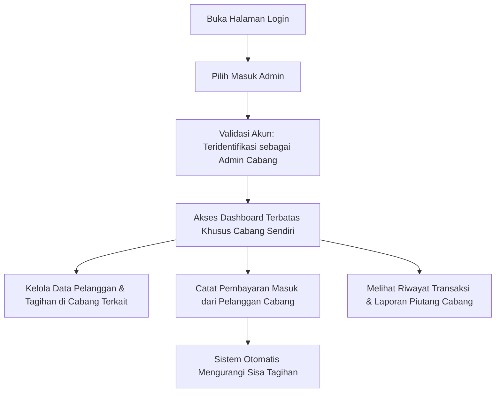
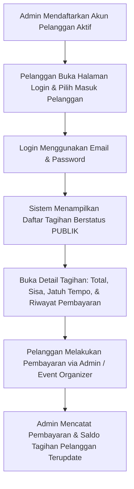
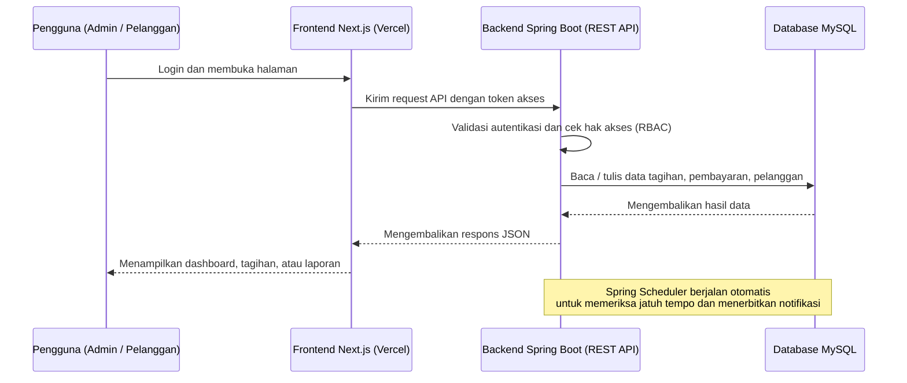
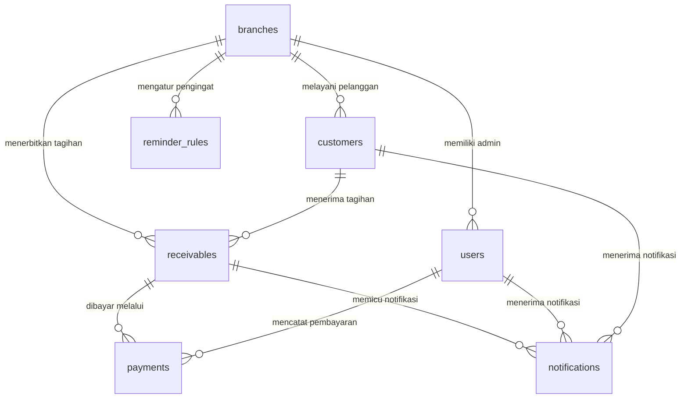

# 📊 Nusa Karsa Event — Sistem Informasi Digitalisasi Pencatatan dan Monitoring Piutang Pelanggan

**Sistem Informasi Digitalisasi Pencatatan dan Monitoring Piutang Pelanggan** adalah aplikasi web terpadu yang dirancang sebagai pusat data (*single source of truth*) bagi seluruh aktivitas pengelolaan piutang usaha pada **Nusa Karsa Event**. Sistem ini mengotomatisasi pencatatan tagihan, rekonsiliasi pembayaran, pemantauan jatuh tempo, dan penyusunan laporan manajemen secara terpusat serta berbasis hak akses wilayah cabang.

---

## 📋 Daftar Isi

1. [Ringkasan Sistem (Overview)](#-ringkasan-sistem-overview)
2. [Kebutuhan Sistem (System Requirements)](#-kebutuhan-sistem-system-requirements)
3. [Fitur Utama Sistem (Core Features)](#-fitur-utama-sistem-core-features)
4. [Alur Pengguna (User Flow)](#-alur-pengguna-user-flow)
5. [Arsitektur Sistem](#-arsitektur-sistem)
6. [Skema Basis Data (Database Schema & ERD)](#-skema-basis-data-database-schema--erd)
7. [Matriks Peran & Hak Akses (RBAC)](#-matriks-peran--hak-akses-rbac)
8. [Teknologi Sistem (Tech Stack)](#-teknologi-sistem-tech-stack)

---

## 🎯 Ringkasan Sistem (Overview)

### Latar Belakang
Sebelum penerapan sistem ini, pengelolaan piutang di **Nusa Karsa Event** dilakukan secara manual. Hal tersebut menimbulkan sejumlah tantangan operasional:
- Tingginya potensi kesalahan pencatatan data tagihan dan pembayaran.
- Proses rekonsiliasi pembayaran dari pelanggan event di berbagai cabang memakan waktu lama.
- Sulitnya memantau tagihan yang mendekati atau telah melewati batas jatuh tempo.
- Penyusunan laporan keuangan piutang untuk manajemen berlangsung lambat dan rentan inkonsistensi data.

### Tujuan & Nilai Utama
Sistem ini hadir untuk mengintegrasikan seluruh operasional piutang dengan prinsip-prinsip:
- **Penyimpanan Terpusat**: Seluruh data tagihan, pembayaran, dan data pelanggan tersimpan dalam satu sistem terpadu.
- **Otoritas Berbasis Wilayah**: Admin Pusat memiliki akses lintas cabang, sedangkan Admin Cabang mengelola transaksi sesuai batas kewenangan cabangnya.
- **Portal Akses Pelanggan**: Pelanggan dapat login secara mandiri untuk melihat daftar tagihan miliknya yang berstatus publik.
- **Peringatan Otomatis**: Setiap tagihan yang mendekati atau melewati jatuh tempo mendapatkan notifikasi pengingat otomatis.
- **Pelaporan Cepat & Akurat**: Laporan rekapitulasi piutang tersaji secara instan, akurat, dan mudah dipahami manajemen.

---

## 📌 Kebutuhan Sistem (System Requirements)

### Kebutuhan Fungsional Utama
- **3 Jalur Akses Pengguna**: Sistem menyediakan akses untuk Admin Pusat, Admin Cabang, dan Pelanggan.
- **Pembagian Hak Akses (RBAC)**: Setiap pengguna hanya dapat mengakses data sesuai peran (*role*) dan cabangnya masing-masing.
- **Kewenangan Admin Pusat**: Mampu memantau, mengelola data tagihan, pembayaran, dan laporan di seluruh cabang.
- **Kewenangan Admin Cabang**: Mengelola tagihan, pembayaran, dan pelanggan khusus pada cabangnya sendiri.
- **Akses Pelanggan Mandiri**: Pelanggan dapat login menggunakan email dan password untuk melihat daftar tagihan miliknya yang berstatus **publik**.
- **Privasi Tagihan**: Tagihan yang ditandai **privat** hanya dapat dilihat oleh admin terkait dan tersembunyi dari akun pelanggan.
- **Pencatatan Pembayaran Otomatis**: Pembayaran dicatat oleh admin dan secara langsung mengurangi nilai sisa tagihan (*remaining amount*).
- **Riwayat & Detail Transaksi**: Menyajikan data historis setiap pembayaran lengkap dengan nominal, metode, tanggal, dan bukti transaksi.
- **Laporan Rekapitulasi Piutang**: Menyajikan rekapitulasi piutang berdasarkan status pembayaran, periode waktu, maupun per cabang.
- **Notifikasi Jatuh Tempo**: Menerbitkan notifikasi otomatis untuk tagihan yang mendekati atau melampaui tanggal jatuh tempo.

### Kebutuhan Non-Fungsional
- **Keamanan Data**: Seluruh kata sandi pengguna disimpan dalam bentuk enkripsi hash yang aman, serta dilindungi kontrol hak akses berbasis peran (RBAC).
- **Kemudahan Penggunaan (User-Friendly)**: Antarmuka dirancang intuitif agar mudah dioperasikan oleh staf admin maupun pelanggan non-teknis.
- **Performa Responsif**: Mampu mengelola volume data transaksi besar secara cepat melalui fitur pencarian (*search*) dan penyaringan (*filter*).
- **Pengembangan Bertahap**: Desain arsitektur modular yang memungkinkan pengembangan fitur baru sesuai kebutuhan bisnis ke depan.

---

## 🚀 Fitur Utama Sistem (Core Features)

Sistem dirancang ke dalam 5 fase fitur utama:

### Fase 1 — Monitoring Tagihan
- **Ringkasan Piutang**: Menampilkan kartu ringkasan total nilai piutang, total dana yang sudah tertagih, dan sisa saldo piutang yang belum terbayar.
- **Daftar Semua Tagihan**: Menampilkan seluruh data tagihan piutang beserta status pembayaran, tanggal jatuh tempo, dan sisa kewajiban pembayaran.
- **Cari & Filter Tagihan**: Mempermudah pencarian tagihan berdasarkan nama pelanggan, status pembayaran, atau cabang pelaksana.
- **Detail Tagihan**: Menyajikan rincian lengkap satu tagihan beserta riwayat seluruh setoran pembayaran yang telah dilakukan.

### Fase 2 — Kelola Tagihan & Pembayaran
- **Kelola Tagihan**:
  - *Tambah Tagihan*: Menerbitkan tagihan baru dengan menentukan pelanggan, rincian nominal, deskripsi event, dan tanggal jatuh tempo.
  - *Ubah Tagihan*: Memperbarui data tagihan apabila terdapat penyesuaian informasi.
  - *Hapus Tagihan*: Menghapus tagihan yang salah atau dibatalkan untuk menjaga kebersihan data.
- **Kelola Pembayaran**:
  - *Catat Pembayaran*: Menginput setoran pembayaran dari pelanggan; sistem secara otomatis mengurangi sisa tagihan.
  - *Riwayat Pembayaran*: Menampilkan kronologi seluruh transaksi pembayaran lengkap dengan tanggal, metode bayar, dan nominal.
  - *Detail Pembayaran*: Menampilkan rincian tanda terima dari setiap transaksi pembayaran.

### Fase 3 — Kelola Pelanggan & Laporan Piutang
- **Kelola Pelanggan**:
  - *Tambah Pelanggan*: Mendaftarkan profil pelanggan baru (nama, kontak, alamat, dan cabang yang melayani).
  - *Ubah Pelanggan*: Memperbarui data kontak dan identitas pelanggan.
  - *Cari Pelanggan*: Menemukan data pelanggan secara instan untuk mempercepat proses penagihan atau pembayaran.
  - *Aktif & Nonaktifkan Pelanggan*: Mengatur status keaktifan akun pelanggan untuk mengontrol izin login ke sistem.
- **Laporan Piutang**:
  - *Rekap Status Piutang*: Laporan ringkasan proporsi tagihan per status (`belum bayar`, `sebagian`, `lunas`, `tertunggak`).
  - *Rekap per Cabang*: Membandingkan performa perolehan piutang dan pembayaran antar cabang.
  - *Filter Periode*: Menyaring data laporan berdasarkan rentang tanggal atau tahun tertentu.
  - *Unduh Laporan*: Mengekspor berkas laporan piutang untuk keperluan arsip dan evaluasi manajemen.

### Fase 4 — Kontrol Akses, Privasi Tagihan, dan Login Pengguna
- **Privasi Tagihan**:
  - *Tandai Tagihan Publik*: Menjadikan tagihan dapat dilihat oleh pelanggan bersangkutan di portal akunnya.
  - *Tandai Tagihan Privat*: Menyembunyikan tagihan dari pelanggan sehingga hanya admin yang memiliki akses melihat.
  - *Ubah Visibilitas Sekaligus*: Mengubah status publik atau privat pada banyak tagihan secara bersamaan.
- **Login & Peran Pengguna**:
  - *Masuk Admin*: Autentikasi untuk Admin Pusat dan Admin Cabang sesuai kredensial masing-masing.
  - *Masuk Pelanggan*: Autentikasi untuk pelanggan menggunakan alamat email dan kata sandi.
  - *Kelola Akun & Peran*: Mengatur akun staf, penugasan cabang, dan hierarki kewenangan.
  - *Keluar Akun*: Mengakhiri sesi pengguna secara aman.

### Fase 5 — Pengingat Jatuh Tempo
- **Notifikasi Tagihan**: Menerima peringatan otomatis di dashboard saat tagihan mulai mendekati tanggal jatuh tempo.
- **Daftar Tagihan Tertunggak**: Menyajikan daftar tagihan yang telah melewati batas jatuh tempo (*overdue*).
- **Atur Pengingat (Reminder Rules)**: Menentukan konfigurasi waktu pemberitahuan pengingat (misal: 7 hari atau 3 hari sebelum jatuh tempo).

---

## 🔄 Alur Pengguna (User Flow)

### 1. Alur Admin Pusat

1. Admin membuka halaman login dan memilih opsi **Masuk Admin**.
2. Sistem memvalidasi username serta password, lalu menetapkan peran sebagai **Admin Pusat**.
3. Admin masuk ke dashboard dan memantau ringkasan piutang konsolidasi dari seluruh cabang.
4. Admin dapat membuat tagihan baru, mencatat pembayaran masuk, atau memperbaiki data tagihan.
5. Admin mengatur visibilitas tagihan apakah berstatus **Publik** (terlihat oleh pelanggan) atau **Privat** (khusus admin).
6. Admin membuka halaman laporan, menentukan parameter filter (periode / cabang), lalu mengunduh dokumen laporan.
7. Sistem menyajikan notifikasi pengingat saat terdapat tagihan yang mendekati atau melampaui jatuh tempo.

---

### 2. Alur Admin Cabang

1. Admin cabang login menggunakan akun pada menu **Masuk Admin**.
2. Sistem mengidentifikasi cabang tempat admin bertugas dan membatasi akses data hanya untuk cabang tersebut.
3. Admin cabang menerbitkan tagihan bagi pelanggan yang berada di wilayah cabangnya.
4. Saat pelanggan melakukan pembayaran, admin mencatat transaksi pembayaran dan sistem secara otomatis mengurangi sisa tagihan.
5. Admin cabang dapat melihat riwayat pembayaran serta laporan piutang khusus untuk cabangnya.

---

### 3. Alur Pelanggan

1. Akun pelanggan dibuat oleh admin dengan email dan kata sandi, serta berstatus aktif.
2. Pelanggan membuka halaman login dan memilih opsi **Masuk Pelanggan**.
3. Pelanggan melihat daftar tagihan atas namanya yang berstatus **Publik** (tagihan berstatus privat tidak ditampilkan).
4. Pelanggan membuka rincian satu tagihan untuk memeriksa total nilai, sisa pembayaran, tanggal jatuh tempo, dan riwayat setoran sebelumnya.
5. Pelanggan melakukan pembayaran melalui admin atau tim event organizer, yang kemudian dicatatkan oleh admin ke dalam sistem.

---

## 🏛️ Arsitektur Sistem

Sistem mengadopsi arsitektur terpisah (*decoupled architecture*) antara Frontend dan Backend REST API untuk menjamin skalabilitas, performa, dan kemudahan pemeliharaan:

- **Frontend**: Menangani tampilan antarmuka, interaksi pengguna, dan rendering halaman secara responsif.
- **Backend API**: Menyediakan layanan RESTful API yang memproses seluruh aturan bisnis, kalkulasi keuangan, manajemen peran (RBAC), dan pengiriman data.
- **Database**: Menyimpan seluruh data master, transaksi, dan riwayat secara terstruktur dan terpusat.
- **Scheduler**: Layanan penjadwalan otomatis di backend yang secara berkala memeriksa tanggal jatuh tempo tagihan dan menerbitkan notifikasi pengingat.

### Komponen Utama
1. **Frontend (Next.js)**: Menyediakan halaman login, dashboard ringkasan, daftar tagihan, formulir pembayaran, master pelanggan, laporan, dan pengaturan akun.
2. **Backend API (Spring Boot)**: Menangani aturan bisnis, validasi integritas data, perhitungan saldo piutang, kontrol hak akses berbasis peran, dan ekspor laporan.
3. **Database (MySQL)**: Menyimpan seluruh data master dan data transaksi secara relasional dengan integritas data yang terjamin.

---

## 🗄️ Skema Basis Data (Database Schema & ERD)

### Entity Relationship Diagram (ERD)

---

### Struktur Tabel Basis Data

#### 1. `branches`
Menyimpan data master cabang Nusa Karsa Event.

| Kolom | Tipe Data | Keterangan |
|---|---|---|
| `id` | BIGINT | Primary key (Auto Increment) |
| `name` | VARCHAR(100) | Nama kantor cabang |
| `address` | TEXT | Alamat lengkap cabang |
| `phone` | VARCHAR(20) | Nomor kontak telepon cabang |

---

#### 2. `users`
Menyimpan akun pengguna internal untuk Admin Pusat dan Admin Cabang.

| Kolom | Tipe Data | Keterangan |
|---|---|---|
| `id` | BIGINT | Primary key (Auto Increment) |
| `username` | VARCHAR(100) | Username unik untuk login admin |
| `password_hash` | VARCHAR(255) | Hash kata sandi akun |
| `role` | VARCHAR(30) | Peran: `ADMIN_PUSAT` atau `ADMIN_CABANG` |
| `full_name` | VARCHAR(150) | Nama lengkap admin |
| `branch_id` | BIGINT | Foreign key ke `branches` (wajib untuk admin cabang, NULL untuk admin pusat) |
| `is_active` | BOOLEAN | Status aktif atau nonaktifnya akun |

---

#### 3. `customers`
Menyimpan master data pelanggan sekaligus akun login untuk portal pelanggan.

| Kolom | Tipe Data | Keterangan |
|---|---|---|
| `id` | BIGINT | Primary key (Auto Increment) |
| `name` | VARCHAR(150) | Nama pelanggan / instansi |
| `email` | VARCHAR(150) | Email unik untuk login pelanggan |
| `password_hash` | VARCHAR(255) | Hash kata sandi login pelanggan |
| `phone` | VARCHAR(20) | Nomor telepon/kontak pelanggan |
| `address` | TEXT | Alamat domisili/kantor pelanggan |
| `branch_id` | BIGINT | Foreign key ke `branches` (cabang yang melayani) |
| `is_active` | BOOLEAN | Mengontrol apakah akun diizinkan login |

---

#### 4. `receivables`
Menyimpan data tagihan piutang dari setiap transaksi event pelanggan.

| Kolom | Tipe Data | Keterangan |
|---|---|---|
| `id` | BIGINT | Primary key (Auto Increment) |
| `customer_id` | BIGINT | Foreign key ke `customers` |
| `branch_id` | BIGINT | Foreign key ke `branches` |
| `description` | VARCHAR(255) | Uraian tagihan atau nama event kegiatan |
| `total_amount` | DECIMAL(15,2) | Total nilai nominal tagihan |
| `paid_amount` | DECIMAL(15,2) | Akumulasi jumlah yang telah dibayarkan |
| `remaining_amount` | DECIMAL(15,2) | Sisa tagihan yang belum dilunasi |
| `status` | VARCHAR(20) | Status: `belum bayar`, `sebagian`, `lunas`, atau `tertunggak` |
| `due_date` | DATE | Tanggal jatuh tempo tagihan |
| `is_public` | BOOLEAN | Visibilitas (`true`: dapat dilihat pelanggan, `false`: hanya admin) |
| `created_at` | DATETIME | Waktu pembuatan tagihan |

---

#### 5. `payments`
Mencatat seluruh transaksi pembayaran yang diterima.

| Kolom | Tipe Data | Keterangan |
|---|---|---|
| `id` | BIGINT | Primary key (Auto Increment) |
| `receivable_id` | BIGINT | Foreign key ke `receivables` |
| `user_id` | BIGINT | Foreign key ke `users` (admin yang mencatat pembayaran) |
| `amount` | DECIMAL(15,2) | Jumlah nominal pembayaran masuk |
| `payment_date` | DATETIME | Tanggal dan waktu transaksi pembayaran |
| `method` | VARCHAR(50) | Metode pembayaran (Transfer, QRIS, Tunai, dll.) |
| `notes` | TEXT | Catatan keterangan transaksi |
| `created_at` | DATETIME | Waktu data dicatat ke sistem |

---

#### 6. `notifications`
Menyimpan notifikasi pengingat jatuh tempo tagihan untuk admin dan pelanggan.

| Kolom | Tipe Data | Keterangan |
|---|---|---|
| `id` | BIGINT | Primary key (Auto Increment) |
| `receivable_id` | BIGINT | Foreign key ke `receivables` sebagai sumber tagihan |
| `user_id` | BIGINT | Foreign key ke `users` (jika penerima notifikasi adalah admin) |
| `customer_id` | BIGINT | Foreign key ke `customers` (jika penerima adalah pelanggan) |
| `title` | VARCHAR(150) | Judul notifikasi |
| `message` | TEXT | Isi lengkap pesan notifikasi |
| `is_read` | BOOLEAN | Status apakah notifikasi sudah dibaca |
| `created_at` | DATETIME | Waktu notifikasi diterbitkan |

---

#### 7. `reminder_rules`
Menyimpan konfigurasi batas waktu pengiriman pengingat tagihan sebelum jatuh tempo.

| Kolom | Tipe Data | Keterangan |
|---|---|---|
| `id` | BIGINT | Primary key (Auto Increment) |
| `branch_id` | BIGINT | Foreign key ke `branches` (NULL bila berlaku untuk semua cabang) |
| `days_before` | INT | Batas hari sebelum jatuh tempo untuk memicu notifikasi |
| `is_active` | BOOLEAN | Status aturan aktif atau nonaktif |

---

## 👥 Matriks Peran & Hak Akses (RBAC)

Penerapan Role-Based Access Control (RBAC) memastikan perlindungan dan pemisahan data antar tingkat pengguna:

| Fitur / Modul | Admin Pusat (`ADMIN_PUSAT`) | Admin Cabang (`ADMIN_CABANG`) | Pelanggan (`CUSTOMER`) |
|---|:---:|:---:|:---:|
| **Akses Dashboard** | Seluruh Cabang | Khusus Cabang Sendiri | Tagihan Pribadi |
| **Kelola Master Cabang** | Penuh (CRUD) | Hanya Baca Cabang Sendiri | Tidak Ada Akses |
| **Kelola Data Pelanggan** | Seluruh Cabang | Khusus Cabang Sendiri | Data Pribadi |
| **Buat & Ubah Tagihan** | ✅ Semua Cabang | ✅ Cabang Sendiri | ❌ Tidak Boleh |
| **Atur Tagihan Publik / Privat** | ✅ Ya | ✅ Ya (Cabang Sendiri) | ❌ Tidak Boleh |
| **Lihat Tagihan Publik** | ✅ Ya | ✅ Ya | ✅ Milik Sendiri Saja |
| **Lihat Tagihan Privat** | ✅ Ya | ✅ Ya (Cabang Sendiri) | ❌ Tersembunyi |
| **Pencatatan Pembayaran** | ✅ Semua Cabang | ✅ Cabang Sendiri | ❌ Tidak Boleh |
| **Riwayat Pembayaran** | ✅ Seluruh Transaksi | ✅ Transaksi Cabang Sendiri | ✅ Transaksi Sendiri |
| **Laporan Piutang & Rekap** | ✅ Lintas Cabang | ✅ Khusus Cabang Sendiri | ❌ Tidak Ada Akses |
| **Konfigurasi Pengingat** | ✅ Global & Cabang | ✅ Cabang Sendiri | ❌ Tidak Ada Akses |

---

## 💻 Teknologi Sistem (Tech Stack)

Sistem dirancang dengan paduan teknologi modern berstandar enterprise:

- **Frontend:**
  - **Next.js dengan TypeScript**: Framework pengembangan antarmuka web modern dengan performa tinggi.
  - **Tailwind CSS & shadcn/ui**: Komponen antarmuka pengguna yang konsisten, elegan, dan adaptif pada berbagai ukuran layar.
  - **Platform Deployment**: Di-deploy pada platform **Vercel**.
- **Backend:**
  - **Spring Boot (Java)**: Framework penyedia RESTful API yang tangguh untuk pemrosesan logika bisnis, validasi, dan manajemen data.
  - **Spring Security (RBAC)**: Pengelolaan keamanan autentikasi dan otorisasi berbasis token akses.
  - **Spring Scheduler**: Eksekusi tugas latar belakang berkala untuk memeriksa tagihan jatuh tempo dan membuat notifikasi otomatis.
  - **Platform Deployment**: Layanan cloud / VPS yang mendukung lingkungan Java (seperti **Railway, Render, AWS, atau VPS mandiri**).
- **Basis Data:**
- **MySQL**: Sistem manajemen basis data relasional (RDBMS) utama untuk penyimpanan data transaksi yang konsisten dan terintegrasi.

## Akun awal lokal

Setelah mengimpor `database/nusa_karsa.sql` dan menjalankan `database/migration_separate_admin_pusat.sql`, jalankan `database/migration_seed_admin_accounts.sql` satu kali. Kredensial setup lokal:

| Peran | Cabang | Username | Password awal |
|---|---|---|---|
| Admin pusat | Semua cabang | `admin` | `NK-Pusat!26_R7q#4` |
| Admin cabang | Palembang | `admin_palembang` | `NK-Palembang!26_R7q` |
| Admin cabang | Bali | `admin_bali` | `NK-Bali!26_X4p#9` |
| Admin cabang | Bandung | `admin_bandung` | `NK-Bandung!26_T8m#2` |

Ganti semua password awal sebelum aplikasi digunakan di lingkungan nyata. Jangan publikasikan kredensial ini ke repositori atau server produksi.
